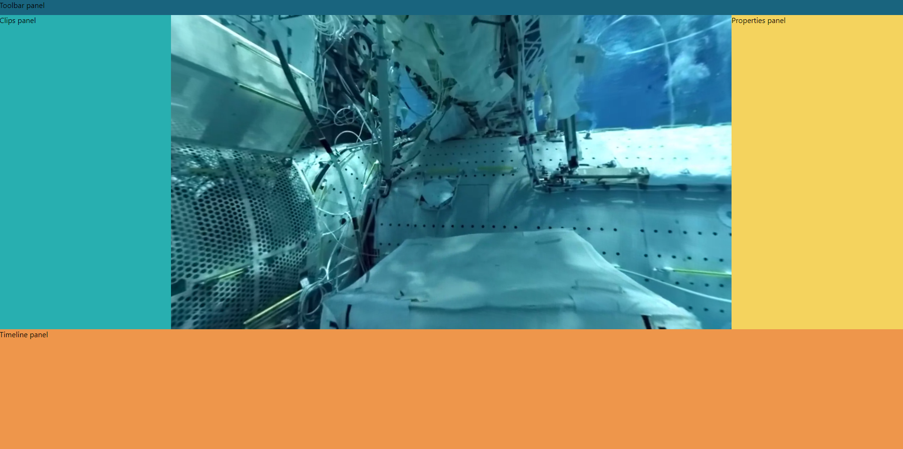

# Dunlin
Welcome to the code repository of the Dunlin project!

Dunlin is an open-source panoramic video editor written using [WebGL](https://www.khronos.org/webgl/) and [ReactJS](https://reactjs.org/). 🤓

## Information
The goal of this project is to provide users of panoramic action cameras with a cheap, cross-platform, video editor. These days, 360 degree media is becoming a lot more common.

Unfortunately, to view or editor your videos, you will probably have to use the camera vendor's own smartphone applications. These apps are fantastic, but might be lacking in some areas.

To avoid the limitations of phone applications, you will most likely want to use a commercial desktop video editing program instead. The downside of these programs is that they are difficult to learn and can be quite expensive too...

Dunlin aims to fill the gap between smartphone video editor applications and complex desktop video editing programs. Using Dunlin, you can easily edit, view, and export your awesome shots without leaving your browser!

## Build instructions
1. Open a terminal window.
2. Navigate to the folder where you would like to clone Dunlin.
3. `git clone https://github.com/tntmeijs/dunlin && pushd dunlin/editor`
4. `yarn install && yarn start`

## FAQ
> Which technology stack has been used to build Dunlin?

*The Dunlin video editor uses ReactJS to make everything dynamic, and WebGL to render the actual video. Everything runs in your browser, how cool is that?!* 😎

> I have a question - how can I reach out to the developer(s)?

*Please open an issue using our [issue tracker](https://github.com/tntmeijs/dunlin/issues).

> Why is this project named "Dunlin"?

Every cool project needs a code name, right? Most projects use Greek gods, but we thought a cute little bird would be a lot friendlier. 🐦

> Can I use this code for commercial purposes?

*If you are interested in using the source code of Dunlin for commercial purposes, please reach out to me on [LinkedIn](https://linkedin.com/in/tntmeijs). I am sure we can work something out.* 😊

> Is Dunlin free to use?

*Dunlin will be free to use during its MVP stage.*
